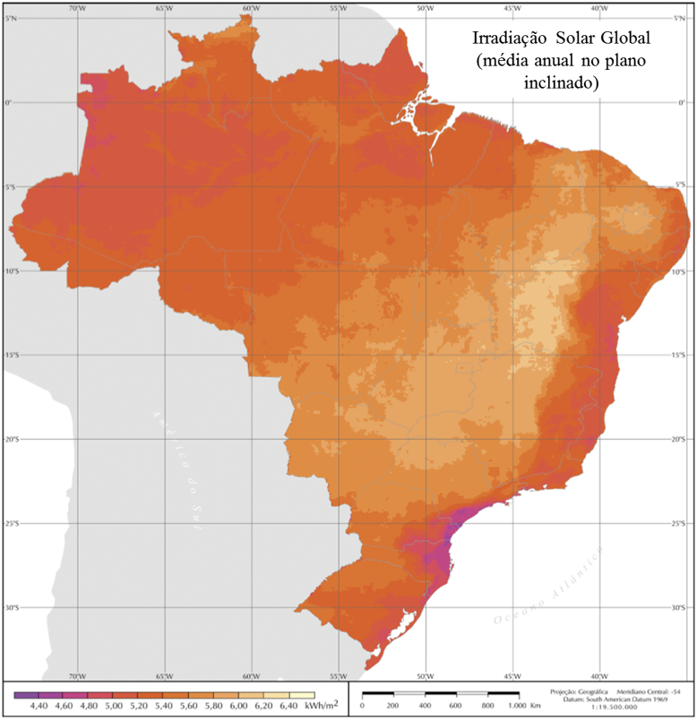
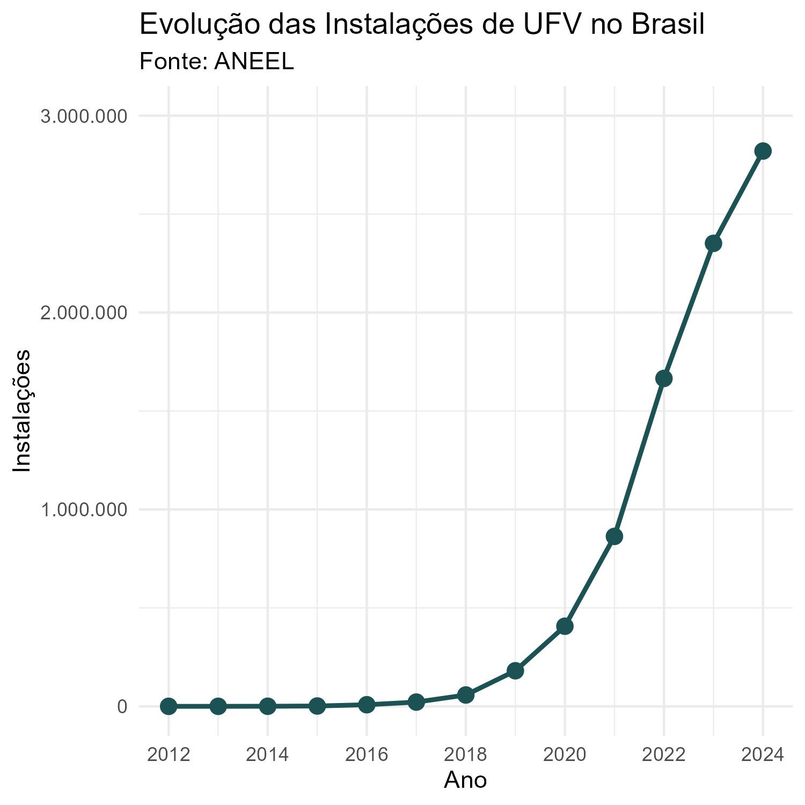
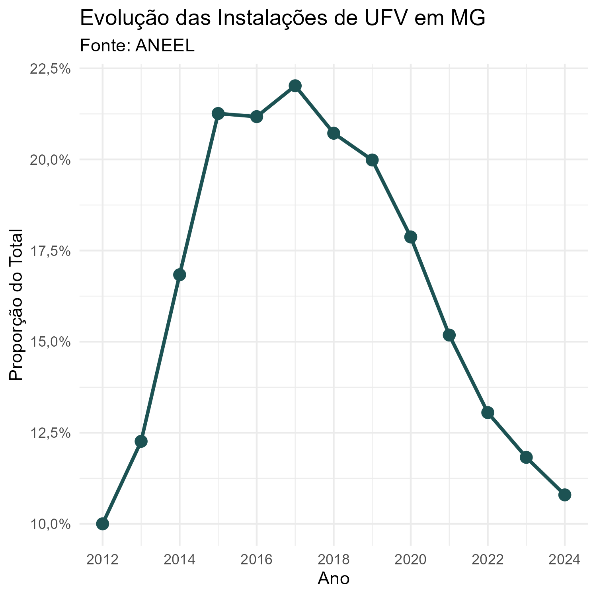
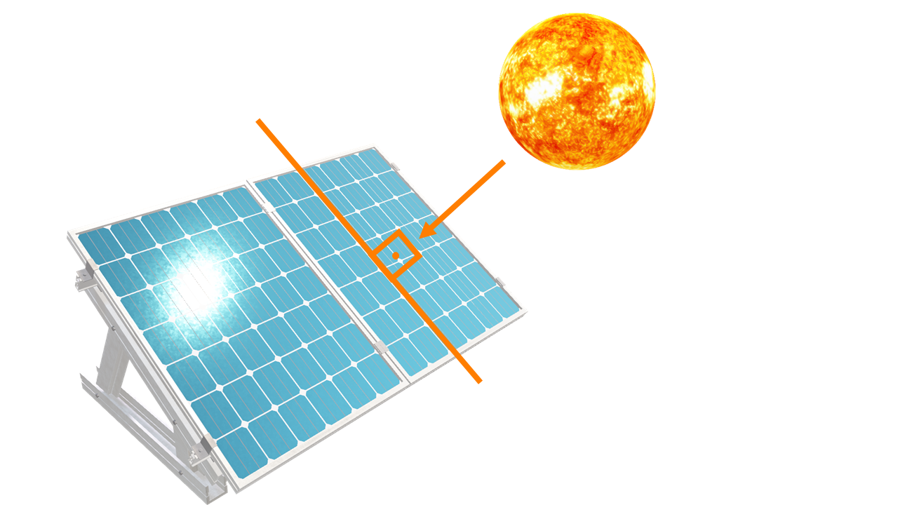
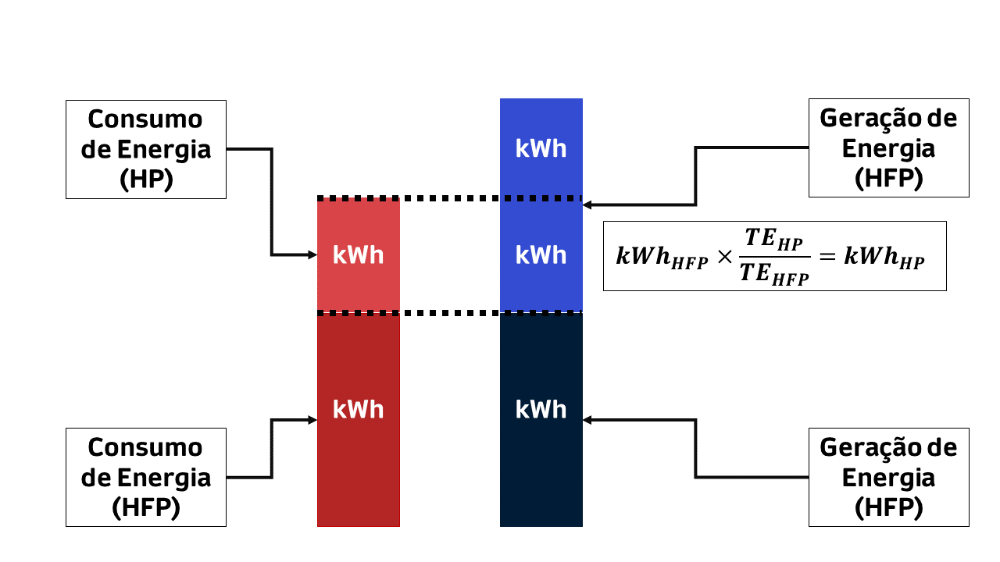
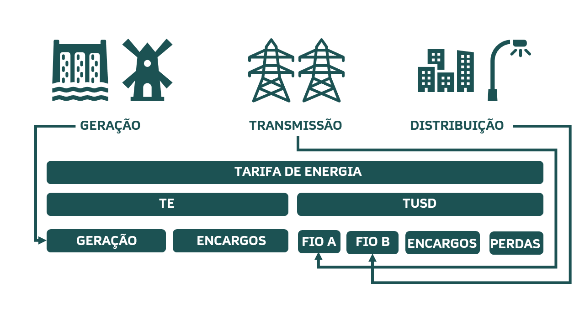
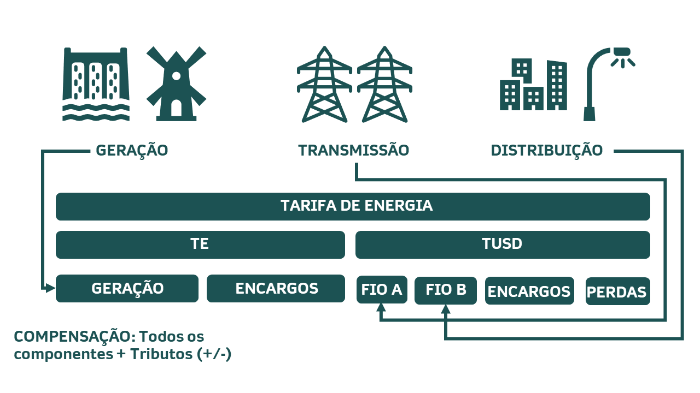
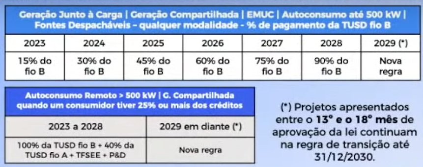
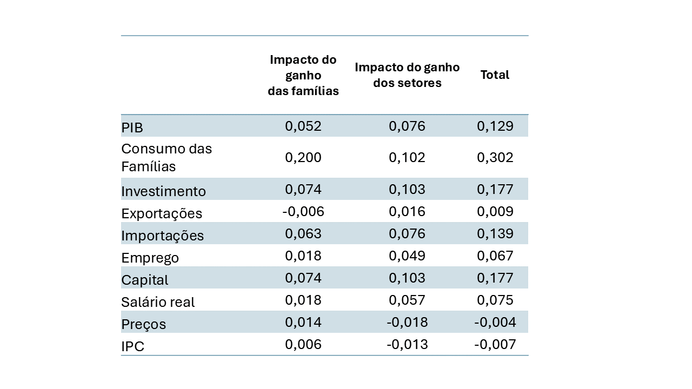

class: inverse
# AGENDA 

```{r, results = 'asis', echo = F, warning = F, message = F, error = F, fig.align ='center'}
# PACOTES UTILIZADOS: ----
library(xaringanExtra)
library(xaringanthemer)
library(magrittr, include.only = '%>%')
library(ggplot2)
library(geobr)

# CONFIGURAÇÃO PADRÃO CHUNK: ----
knitr::opts_chunk$set(echo = F,
                      results = 'asis', 
                      warning = F, 
                      message = F, 
                      error = F, 
                      fig.align = 'center', 
                      out.width = '100%')

# CONFIGURAÇÃO DA FONTE: ----
style_mono_accent(base_color = '#1c5253',
                  text_font_size = '30px',
                  header_h1_font_size = '3rem',
                  header_h2_font_size = '2rem',
                  header_h3_font_size = '1.5rem')


# RECURSOS DO SLIDE: ----
use_scribble()
use_search(show_icon = TRUE)
```


</br>

- [**.white[QUEM SOMOS?]**](#quem_somos)


- [**.white[GERAÇÃO DISTRIBUÍDA NO BRASIL]**](#gd_brasil)

- [**.white[IMPACTO ECONÔMICO DA GD EM MINAS GERAIS]**](#impacto_gd)

---
class: inverse, middle, center
name: quem_somos
# QUEM SOMOS?


---
<div style="text-align: justify">
# QUEM SOMOS?
----

- A **Rede de Análise em Energia Renovável e Desenvolvimento Econômico (RAERDE)** foi 
criada a partir de um projeto de pesquisa:

  - "Impactos Econômicos da Geração Solar Fotovoltaica Distribuída no Estado de Minas Gerais: Uma Abordagem   de Modelagem Inter-Regional de Equilíbrio Geral Computável";
  - 36 Meses (R$ 1.275.345,72).

- Edital nº 007/2021 (FAPEMIG):

  - Redes de Pesquisa Científica e Desenvolvimento Tecnológico com Foco em Demandas Estratégicas.


---
<div style="text-align: justify">
# QUEM SOMOS?
----

- Somos compostos por 4 Universidades Federais de Minas Gerais:

  - Universidade Federal de Itajubá (**UNIFEI**);
  - Universidade Federal de Lavras (**UFLA**);
  - Universidade Federal de Minas Gerais (**UFMG**);
  - Universidade Federal de Juiz de Fora (**UFJF**).

- Por sua vez as Universidades Federais são organizadas em 2 Núcleos:

  - **Núcleo de Modelagem Financeira de Empreendimentos**;
  - **Núcleo de Modelagem Econômica Regional**.


---
<div style="text-align: justify">
# QUEM SOMOS?
----

 - Prof. Dr. Victor Eduardo de Mello Valerio (UNIFEI);
 - Prof. Dr. Admir Antonio Betarelli Junior (UFJF);
 - Profa. Dra. Aline Souza Magalhães (UFMG);
 - Prof. Dr. André Luis Ribeiro Lima (UFLA);
 - Prof. Dr. André Luiz Medeiros (UNIFEI);
 - Prof. Dr. Edson Paulo Domingues (UFMG);
 - Prof. Dr. Fernando Salgueiro Perobelli (UFJF);
 - Prof. Dr. Moisés Diniz Vassallo (UNIFEI);
 - Prof. Dr. Rafael Moraes e Souza (UFJF);
 - Prof. Dr. Weslem Rodrigues Faria (UFJF).
 
 
---
<div style="text-align: justify">
# QUEM SOMOS?
----

- Bolsistas de Doutorado:

  - Filipe Vasconcelos Rocha (UFJF);
  - Guilherme Perobelli Salgueiro (UFMG).
  
- Bolsistas de Mestrado:

  - Felipe de Souza Oliveira (UFJF).

- Bolsistas de Graduação:

  - Letícia Ventura (UNIFEI);
  - João Pedro de Oliveira Barbosa (UFJF).

---
<div style="text-align: justify">
# QUEM SOMOS?
----

**Objetivo Geral:**

- Avaliar os impactos da geração solar fotovoltaica no contexto da Geração Distribuída no estado de Minas Gerais, considerando tanto os investimentos realizados até o fim do período de transição, quanto os impactos relacionados às implicações do marco regulatório estipulado pela Lei Nº 14.300/2022 a partir de cenários simulados.


---
<div style="text-align: justify">
# QUEM SOMOS?
----

**Objetivos específicos:**

- Mensurar os potenciais efeitos econômicos regionais associados à inserção de geradores fotovoltaicos no contexto da geração distribuída no estado de Minas Gerais até o fim do período de transição estipulado pela lei;

- Mensurar os potenciais efeitos econômicos regionais associados à inserção de geradores fotovoltaicos no estado de Minas Gerais a partir de cenários simulados relacionados a entrada em operação das novas regras referentes à lei.

---
<div style="text-align: justify">
# QUEM SOMOS?
----

**Resultados esperados da pesquisa**

- Estimativas das rentabilidades dos projetos instalados até o fim do período de             transição da lei 14.300/2022 (que removeu parte dos incentivos iniciais à GD);

- Projeções após a promulgação da lei;

- Mensuração dos potenciais efeitos econômicos regionais associados à inserção de            geradores fotovoltaicos no contexto da geração distribuída no estado.

---
<div style="text-align: justify">
# QUEM SOMOS?
----

- Neste momento estamos desenvolvendo uma série de materiais a respeito de energia
renovável (com foco econômico). 

  - Dashboard de Impacto Econômico;
  - Site da Rede;
  - Textos de Análise;
  - Seminário.

---
class: inverse, middle, center
name: gd_brasil
# GERAÇÃO DISTRIBUÍDA NO BRASIL


---
<div style="text-align: justify">
# GERAÇÃO DISTRIBUÍDA NO BRASIL
----

- **Geração distribuída** refere-se a um sistema de produção de energia elétrica conectado
à **rede de distribuição** de energia elétrica, independente da fonte de geração.


- Em oposição tem-se o modelo tradicional brasileiro em que a geração ocorre em grandes 
usinas de energia remotas e, em seguida, esta energia elétrica é transmitida 
para subestações e, então, distribuídas aos consumidores finais. 


---
<div style="text-align: justify">
# GERAÇÃO DISTRIBUÍDA NO BRASIL
----

- Contudo, no Brasil a definição de geração distribuída ganha alguns contornos 
(limitações por regulação), tais como:

  - **Tipo de Fonte**: Renovável (hidráulica-pch, eólica, biomassa e cogeração 
  qualificada, **fotovoltaica**);
  - **Potência (Tamanho)**: Apenas miniusinas (ou microusinas).
  
- A partir da limitação de utilização de fontes renováveis, as miniusinas (ou 
microusinas) fotovoltaicas ganham especial destaque no mercado brasileiro.


---
<div style="text-align: justify">
# GERAÇÃO DISTRIBUÍDA NO BRASIL
----

- Existem uma série de benefícios associados à utilização da fonte fotovoltaica:

  - Fonte inesgotável;
  - Reduzido consumo de água e área para instalações;
  - Reduzida necessidade de manutenção;
  - Incentivo à pesquisa;
  - **Desenvolvimento Regional**.
  
- No Brasil a fonte fotovoltaica possui elevada adaptabilidade à **geração 
descentralizada (geração distribuída)**.


---
<div style="text-align: justify">
# GERAÇÃO DISTRIBUÍDA NO BRASIL
----

- Esta adaptabilidade à geração descentralizada ocorre na medida em que o nosso
país possui vasta disponibilidade de recurso solar em todo território;

  - A soma anual de irradiação global em qualquer lugar no **BRASIL** 
  encontra-se no intervalo de **1.500 kWh/m² à 2.500 kWh/m²**.


- Portanto, nossa irradiação é muito maior que países referência;

  - A soma anual de irradiação global em qualquer lugar no **ALEMANHA** 
  encontra-se no intervalo de **900 kWh/m² à 1.250 kWh/m²**.


---
name: mapa_recurso_solar
<div style="text-align: justify">
# GERAÇÃO DISTRIBUÍDA NO BRASIL


```{r, results = 'asis', echo = F, warning = F, message = F, error = F, fig.align ='center', out.width = '40%'}

# # BAIXANDO MAPA MUNICIPAL:
# mapa <- geobr::read_municipality(year = 2019,
#                                  showProgress = FALSE)
# 
# # IMPORTAÇÃO DA BASE DE DADOS DE RECURSO SOLAR:
# recurso_solar <- readxl::read_xlsx(path = 'recurso_solar_municipios.xlsx')
# 
# # ARRUMANDO OS DADOS COM CRUZAMENTO COM MAPA:
# recurso_solar <- recurso_solar %>%
#   dplyr::filter(angulo %in% c('Plano Horizontal', 'Ângulo igual a latitude')) %>%
#   dplyr::select(codigo_ibge, media, angulo) %>%
#   dplyr::mutate(angulo = ifelse(angulo == 'Plano Horizontal', 'Plano Horizontal',
#                                 'Ângulo Igual a Latitude'))
# 
# recurso_solar <- dplyr::full_join(mapa, recurso_solar,
#                                   by = c('code_muni' = 'codigo_ibge'))
# 
# 
# # GERANDO A VISUALIZAÇÃO DO MAPA:
# config_grafico <- theme(axis.title = element_blank(),
#                         axis.text = element_blank(),
#                         axis.ticks = element_blank(),
#                         legend.position = 'none')
# 
# grafico <- recurso_solar %>%
#   dplyr::filter(angulo == 'Plano Horizontal') %>% 
#   ggplot() +
#   geom_sf(mapping = aes(fill = media)) +
#   scale_fill_gradient(low = 'white', high = '#1c5253') +
#   labs(fill = '') +
#   theme_minimal() +
#   config_grafico
# 
# grafico

```


---
<div style="text-align: justify">
# GERAÇÃO DISTRIBUÍDA NO BRASIL
----


- Apesar da vasta disponibilidade do recurso solar, a indústria fotovoltaica 
ainda está em desenvolvimento no país;


- Este atraso na utilização da fonte pode ser explicado ao entendimento de que a 
energia solar fotovoltaica correspondia a uma fonte complementar, consistente 
apenas em contextos de pequenos **SISTEMAS ISOLADOS**.


---
<div style="text-align: justify">
# GERAÇÃO DISTRIBUÍDA NO BRASIL
----

- PROGRAMAS DE INCENTIVO À UTILIZAÇÃO DE ENERGIA FOTOVOLTAICA NO BRASIL

  - Chamada pública n° 13/2011 da Aneel – “Projeto Estratégico Arranjos Técnicos
  e Comerciais para Inserção da Geração Solar Fotovoltaica na Matriz Energética 
  Brasileira”;

  - **RESULTADO**: Aproximadamente 395 milhões de reais foram investidos em 18 
  projetos diferentes, representando uma expansão de potência instalada no Brasil 
  próxima a 24,6 MW.


---
<div style="text-align: justify">
# GERAÇÃO DISTRIBUÍDA NO BRASIL
----


- PROGRAMAS DE INCENTIVO À UTILIZAÇÃO DE ENERGIA FOTOVOLTAICA NO BRASIL

  - 6º leilão de energia de reserva organizados pela ANEEL e operacionalizados 
  pela CCEE em 31 de outubro de 2014;

  - 7º leilão de energia de reserva organizados pela ANEEL e operacionalizados 
  pela CCEE em 28 de setembro de 2015.


---
<div style="text-align: justify">
# GERAÇÃO DISTRIBUÍDA NO BRASIL


```{r , results = 'asis', echo = F, warning = F, message = F, error = F, fig.align ='center'}


library(magrittr)
library(kableExtra)


leiloes <- data.frame(
  
  resultados = c('Número de empreendimentos cadastrados',
                 'Número de empreendimentos habilitados',
                 'Potência nominal contratada (MW)',
                 'Garantia física contratada (MWmédio)',
                 'Preço inicial de venda de energia (R$/MWh)',
                 'Preço final de venda de energia (R$/MWh)'),
  sexto = c('400','331','889,7','202,3','262','215,1'),
  setimo = c('382','341','833,8','232,9','349','301,8'))


knitr::kable(leiloes, 
             escape = FALSE,
             format = 'html',
             align = c('c', 'c', 'c'),
             col.names = c('RESULTADOS', 
                           '6º LEILÃO', 
                           '7º LEILÃO')) %>%
  
  kable_styling(bootstrap_options = 'striped')


```


### Fonte: ANEEL.


---
<div style="text-align: justify">
# GERAÇÃO DISTRIBUÍDA NO BRASIL
----


- Todos estes programas foram muito importantes para a inserção da fonte 
fotovoltaica na matriz energética brasileira uma vez que:

  - Geraram desenvolvimento do **MERCADO FOTOVOLTAICO** ao desenvolver toda a 
  cadeia de produção;
  
  - Geraram **DESENVOLVIMENTO TÉCNICO** nos contextos acadêmicos e comerciais.

---
<div style="text-align: justify">
# GERAÇÃO DISTRIBUÍDA NO BRASIL
----

- Contudo, o marco regulatório que efetivamente abriu o mercado de geração solar 
fotovoltaica residencial e comercial foi definido pela publicação da **RESOLUÇÃO
NORMATIVA Nº 482/2012** que estabelecia os parâmetros de **ACESSO**, **CONEXÃO**, 
**SEGURANÇA** e **TARIFAÇÃO** da **GERAÇÃO DISTRIBUÍDA**;


- Deve-se ressaltar que a Resolução Normativa n° 482/2012 não tratava apenas da 
fonte fotovoltaica, mas da geração distribuída de pequeno porte a partir das 
demais fontes renováveis, tais como a hidráulica (pch), a eólica, a biomassa e a 
cogeração qualificada. 


---
<div style="text-align: justify">
# GERAÇÃO DISTRIBUÍDA NO BRASIL
----

- A fonte solar fotovoltaica corresponde à **99,97%** do total de 
conexões à rede elétrica, **98,13%** do total de consumidores 
atendidos e **99,14%** do total de potência nominal instalada:

  - Usinas: 2.820.043 (2.819.283);

  - Unidades Consumidoras: 4.094.010 (4.017.763);

  - Potência Instalada: 31.640.177 kWp (31.368.375);
  
  - Municípios: 5.554 (5.554).


- [**Dashboard**](https://app.powerbi.com/view?r=eyJrIjoiY2VmMmUwN2QtYWFiOS00ZDE3LWI3NDMtZDk0NGI4MGU2NTkxIiwidCI6IjQwZDZmOWI4LWVjYTctNDZhMi05MmQ0LWVhNGU5YzAxNzBlMSIsImMiOjR9)

---
<div style="text-align: justify">
# GERAÇÃO DISTRIBUÍDA NO BRASIL
----

```{r, results = 'asis', echo = F, warning = F, message = F, error = F, fig.align ='center', out.width = '40%'}

```


---
<div style="text-align: justify">
# GERAÇÃO DISTRIBUÍDA NO BRASIL
----

```{r, results = 'asis', echo = F, warning = F, message = F, error = F, fig.align ='center', out.width = '40%'}

```


---
class: inverse, middle, center
name: aspectos_regulatorios


# ASPECTOS REGULATÓRIOS


---
<div style="text-align: justify">
# ASPECTOS REGULATÓRIOS


**RESOLUÇÃO NORMATIVA Nº 482/2012**


- A Resolução Normativa n° 482/2012 normatizou os parâmetros da geração 
distribuída. No que se refere a categorização de geração, definiu-se por:

  - **MICROGERAÇÃO**: sistemas geradores com potência nominal instalada de até 
  **100 kW**;

  - **MINIGERAÇÃO**: sistemas geradores com potência nominal instalada entre 
  **100 kW e 1 MW**.


---
<div style="text-align: justify">
# ASPECTOS REGULATÓRIOS


**RESOLUÇÃO NORMATIVA Nº 482/2012**


- **REGIME DE COMPENSAÇÃO**: sistema de compensação de energia elétrica (em inglês, 
**_NET METERING_**). O medidor de energia registra a quantidade de 
energia consumida e produzida, sendo apurado o saldo ao final do **MÊS**.


---
<div style="text-align: justify">
# ASPECTOS REGULATÓRIOS


**RESOLUÇÃO NORMATIVA Nº 482/2012**


- **Art. 2 - III**: _sistema de compensação de energia elétrica: sistema no qual
a **ENERGIA ATIVA INJETADA** por unidade consumidora com microgeração ou 
minigeração distribuída é cedida, por meio de empréstimo gratuito, à 
distribuidora local e posteriormente compensada com o **CONSUMO DE ENERGIA 
ELÉTRICA ATIVA**._


---
<div style="text-align: justify">
# ASPECTOS REGULATÓRIOS


**RESOLUÇÃO NORMATIVA Nº 482/2012**


- REGIME DE COMPENSAÇÃO:

  - $Quantidade \ Consumida > Quantidade \ Produzida \implies$ 
  $Pagamento = Quantidade \ Consumida - Quantidade \ Produzida$

  - $Quantidade \ Produzida > Quantidade \ Consumida \implies$
  $Crédito = Quantidade \ Produzida - Quantidade \ Consumida$


- **OBSERVAÇÃO**: Em caso de saldo positivo (geração de créditos de 
energia a ser compensado), estipulou-se um prazo de **36 MESES** para utilização. 


---
<div style="text-align: justify">
# ASPECTOS REGULATÓRIOS


**RESOLUÇÃO NORMATIVA Nº 482/2012**


- **REGIME DE COMPENSAÇÃO**: Independente do saldo entre as quantidades consumidas 
e produzidas por uma unidade consumidora que possui um sistema fotovoltaico 
instalado, estabeleceu-se um mínimo a ser pago e, de acordo com a modalidade 
tarifária, estabeleceu-se um fator de ajuste de acordo com o posto tarifário. 


---
<div style="text-align: justify">
# ASPECTOS REGULATÓRIOS


**RESOLUÇÃO NORMATIVA Nº 482/2012**


- **Art. 7 - III**: _No faturamento de unidade consumidora integrante do 
sistema de compensação de energia elétrica deverão ser observados os seguintes 
procedimentos: deverá ser cobrado, no mínimo, o valor referente ao **CUSTO DE 
DISPONIBILIDADE** para o consumidor do **GRUPO B**, ou da **DEMANDA 
CONTRATADA** para o consumidor do **GRUPO A**, conforme o caso._


---
<div style="text-align: justify">
# ASPECTOS REGULATÓRIOS


**RESOLUÇÃO NORMATIVA Nº 482/2012**


- **Art. 7 - XI**: _em cada unidade consumidora participante do sistema de 
compensação de energia elétrica, a compensação deve se dar **PRIMEIRAMENTE NO
POSTO TARIFÁRIO EM QUE OCORREU A GERAÇÃO E, POSTERIORMENTE, NOS DEMAIS POSTOS 
TARIFÁRIOS**, devendo ser observada a relação dos valores das 
**TARIFAS DE ENERGIA – TE (R$/MWh)**, publicadas nas Resoluções Homologatórias 
que aprovam os processos tarifários, se houver._


---
class: inverse
<div style="text-align: justify">
# MODALIDADES TARIFÁRIAS 

- **.white[CONSUMO]**: Corresponde a quantidade de 
**.white[ENERGIA CONSUMIDA NO TEMPO]**. Por exemplo, se uma lâmpada de 60W 
permanece ligada por 4 horas, ela consumirá 240Wh;

- **.white[DEMANDA]**: Corresponde a **.white[POTÊNCIA INSTANTÂNEA DEMANDADA]** 
por um equipamento ou conjunto de equipamentos como no caso de uma unidade 
consumidora. Por exemplo, a lâmpada do exemplo anterior demanda 60W de potência 
enquanto está ligada. Duas lâmpadas de 60W demandam 120W de potência enquanto 
ligadas.


---
class: inverse
<div style="text-align: justify">
# MODALIDADES TARIFÁRIAS 


- **.white[GRUPO B - BAIXA TENSÃO]**: Correspondem aos consumidores atendidos 
em baixa tensão. Em geral, residências (ou edfícios residenciais), pequenos 
comércios.

  - **.white[CONVENCIONAL MONÔMIA]**: Tarifa única de consumo de energia elétrica, 
  independentemente das horas de utilização do dia. 


---
class: inverse
<div style="text-align: justify">
# MODALIDADES TARIFÁRIAS 


- **.white[CUSTO DE DISPONIBILIDADE]**: representa um pagamento mínimo cobrado 
pela concessionária ("referente ao custo de disponibilidade de acesso à rede");

  - Padrão monofásico: No mínimo deve-se pagar 30 kWh
  
  - Padrão Bifásico: No mínimo deve-se pagar 50 kWh
  
  - Padrão Trifásico: No mínimo deve-se pagar 100 kWh.


---
class: inverse
<div style="text-align: justify">
# MODALIDADES TARIFÁRIAS 


- **.white[GRUPO A - ALTA TENSÃO]**: Correspondem aos consumidores atendidos em 
alta tensão. Empresas de médio ou grande porte como supermercados, indústrias, 
hospitais e/ou shoppings.

  - **.white[TARIFA VERDE]**: modalidade caracterizada por tarifas diferenciadas 
  de consumo de energia elétrica de acordo com as horas de utilização do dia
  **.white["POSTO TARIFÁRIO"]**, e uma única tarifa de demanda de potência.
  
  - **.white[TARIFA AZUL]**: modalidade caracterizada portarifas diferenciadas 
  de consumo e de demanda de acordo com o horário de utilização da energia no 
  dia **.white["POSTO TARIFÁRIO"]**.


---
class: inverse
<div style="text-align: justify">
# MODALIDADES TARIFÁRIAS


- **.white[DEMANDA CONTRATADA]**: Estabelecida em contrato junto à 
concessionária e a partir do estudo da carga da unidade consumidora 
**.white[CUSD - CONTRATO DE USO DO SISTEMA DE DISTRIBUIÇÃO]**.


- **.white[POSTO TARIFÁRIO]**: São definidos por distribuidora, no seu processo 
de revisão tarifária periódica (a cada 4 ou 5 anos).

  - **.white[HORÁRIO DE PONTA (HP)]**: Período diário de 3h consecutivas, com 
  exceção feita aos sábados, domingos e feriados nacionais.
  
  - **.white[HORÁRIO FORA DE PONTA (HFP)]**: Período diário composto pelas horas 
  consecutivas e complementares ao horário de ponta.


---
<div style="text-align: justify">
# MODALIDADES TARIFÁRIAS


```{r , results = 'asis', echo = F, warning = F, message = F, error = F, fig.align ='center'}


library(magrittr)
library(kableExtra)


hp <- data.frame(
  concessionaria = c('CEMIG',
                     'LIGHT',
                     'ELETROPAULO',
                     'ENEL',
                     'ELEKTRO'),
  estado = c('MG',
             'RJ',
             'SP',
             'SP; RJ; GO',
             'SP; MS'),
  hp = c('17h às 20h',
         '17:30H às 20:30H',
         '17:30H às 20:30H',
         '18h às 21h',
         '17:30H às 20:30H'))


knitr::kable(hp, 
             escape = FALSE,
             format = 'html',
             align = c('c', 'c', 'c'),
             col.names = c('CONCESSIONÁRIAS', 
                           'ESTADO', 
                           'HORÁRIO DE PONTA (HP)')) %>%
  
  kable_styling(bootstrap_options = 'striped')


```

### Fonte: [ANEEL](https://app.powerbi.com/view?r=eyJrIjoiMTEzZDgyMzctNGQzZS00MTVkLTg3M2UtOGMwNjBjMzM2MGVmIiwidCI6IjQwZDZmOWI4LWVjYTctNDZhMi05MmQ0LWVhNGU5YzAxNzBlMSIsImMiOjR9).


---
<div style="text-align: justify">
## ASPECTOS REGULATÓRIOS


**RESOLUÇÃO NORMATIVA Nº 482/2012**


- A **GERAÇÃO DE ENERGIA FOTOVOLTAICA** ocorre majoritariamente no 
**POSTO TARIFÁRIO FORA DE PONTA (HFP)**. 


```{r, results = 'asis', echo = F, warning = F, message = F, error = F, fig.align ='center', out.width = '65%'}





```


---
<div style="text-align: justify">
# ASPECTOS REGULATÓRIOS


```{r, results = 'asis', echo = F, warning = F, message = F, error = F, fig.align ='center', out.width = '70%'}





```


---
<div style="text-align: justify">
# ASPECTOS REGULATÓRIOS


- Composição da Tarifa:


```{r, results = 'asis', echo = F, warning = F, message = F, error = F, fig.align ='center', out.width = '70%'}





```


---
<div style="text-align: justify">
# ASPECTOS REGULATÓRIOS


**RESOLUÇÃO NORMATIVA Nº 482/2012**


- Este **FATOR DE AJUSTE**, presente nas instalações em alta tensão, acaba por 
aumentar o dimendionamento para atender um determinado nível de consumo no 
horário de ponta. Deste modo, o valor do **INVESTIMENTO TAMBÉM AUMENTA**, 
**PREJUDICANDO O RESULTADO FINANCEIRO DO EMPREENDIMENTO**.


---
<div style="text-align: justify">
# ASPECTOS REGULATÓRIOS


- Devido a intensa expansão de instalações fotovoltaicos conectados à rede, 
a ANEEL alterou os parâmetros supracitados a partir da publicação da **RESOLUÇÃO 
NORMATIVA Nº 687/2015**;


- Acrescenta-se que, de fato, as revisões regulamentares já eram previstas para
cada triênio.


---
<div style="text-align: justify">
# ASPECTOS REGULATÓRIOS


**RESOLUÇÃO NORMATIVA Nº 687/2015**
  
  
- As principais diferenças foram nas próprias categorias:

  - **MICROGERAÇÃO**: sistemas geradores com potência nominal instalada de até 
  **75 kW**;

  - **MINIGERAÇÃO**: sistemas geradores com potência nominal instalada entre 
  **75 kW e 5 MW**.


---
<div style="text-align: justify">
# ASPECTOS REGULATÓRIOS


**RESOLUÇÃO NORMATIVA Nº 687/2015**


- Quanto ao sistema de compensação de energia elétrica, a 
**RESOLUÇÃO NORMATIVA Nº 687/2015** expandiu o prazo de 
**UTILIZAÇÃO DOS CRÉDITOS** de energia de 36 meses para até **60 MESES**;


- A **RESOLUÇÃO NORMATIVA Nº 687/2015** estabeleceu ainda, além da **GERAÇÃO NA 
PRÓPRIA UNIDADE (GPU)** já estabelecida pela resolução normativa nº 482/2012, a 
possibilidade de compensação dos créditos de determinada unidade de geração 
distribuída em outras unidades de consumo, para tanto, três definições de 
modalidades. 


---
<div style="text-align: justify">
# ASPECTOS REGULATÓRIOS


**RESOLUÇÃO NORMATIVA Nº 687/2015**


 - **AUTOCONSUMO REMOTO (AR)**: Consumidores de mesma titularidade, Pessoa 
 física ou jurídica (matriz e filial), abastecidos pela mesma concessionária 
 distribuidora, tal que a unidade consumidora com mini ou microgeração 
 distribuída se situa em local diferente das unidades consumidoras a serem 
 compensados os créditos.


---
<div style="text-align: justify">
# ASPECTOS REGULATÓRIOS


**RESOLUÇÃO NORMATIVA Nº 687/2015**


- **GERAÇÃO COMPARTILHADA (GC)**: Consumidores com Cadastro de Pessoa Física 
(CPF) e/ou Cadastro Nacional de Pessoa Jurídica (CNPJ) distintos associados por 
cooperativa, ou consórcio, abastecidos pela mesma concessionária distribuidora, 
tal que a unidade consumidora com mini ou microgeração distribuída se situa em 
local diferente das unidades consumidoras a serem compensados os créditos.


---
<div style="text-align: justify">
# ASPECTOS REGULATÓRIOS


**RESOLUÇÃO NORMATIVA Nº 687/2015**


- **MÚLTIPLAS UNIDADES CONSUMIDORAS (MUC)**: Consumidores localizados em 
condomínios verticais e/ou horizontais localizados na mesma área da a unidade 
consumidora com mini ou microgeração distribuída, tal que os créditos são 
compensados proporcionalmente nas unidades consumidoras individualizadas e nas 
unidades consumidoras comuns.


---
<div style="text-align: justify">
# ASPECTOS REGULATÓRIOS


- Em relação aos **TRIBUTOS**, a **RECEITA FEDERAL** e as **SECRETARIAS DA 
FAZENDA ESTADUAIS** adequaram as cobranças dos respectivos tributos federais 
(Programa de Integração Social, **PIS**, e Contribuição para Financiamento da 
Seguridade Social, **COFINS**) e estaduais (Imposto sobre Circulação de Mercadorias 
e Serviços – **ICMS**) às unidades consumidoras com microgeração ou minigeração 
distribuída.


---
<div style="text-align: justify">
# ASPECTOS REGULATÓRIOS


- **PIS/COFINS**: A primeira normativa para o contexto da geração distribuída 
ocorreu apenas em 2015, a partir da Lei nº 13.169/2015 que instituiu como base 
de incidência do PIS e COFINS a diferença positiva entre a energia consumida e 
a energia produzida pela unidade consumidora com microgeração ou minigeração 
distribuída;


---
<div style="text-align: justify">
# ASPECTOS REGULATÓRIOS


- **ICMS**: A primeira normativa para o contexto da geração distribuída ocorreu 
em 2013 quando o Conselho Nacional de Política Fazendária (CONFAZ) publicou o 
convênio ICMS 6/2013 que instituía como base de incidência do ICMS toda a 
quantidade de energia consumida, independentemente da produção de energia da 
unidade consumidora com microgeração ou minigeração distribuída. 


---
<div style="text-align: justify">
# ASPECTOS REGULATÓRIOS

- Porém, em 2014 o CONFAZ revogou o convênio 6/2013 ao publicar o convênio 
16/2015 que instituiu como base de incidência de ICMS a diferença entre a 
energia consumida e a energia produzida pela unidade consumidora com 
microgeração ou minigeração distribuída. 

- Por se tratar de um convênio (não obrigatoriedade de adesão), ao todo 5 
estados permaneceram no convênio 6/2013, Santa Catarina, Paraná, Espírito Santo, 
Amazonas e Amapá.


---
<div style="text-align: justify">
# ASPECTOS REGULATÓRIOS


- A um ponto de destaque a ser analisado, em 2014 o CONFAZ o convênio 16/2015 que
instituiu como base de incidência de ICMS a diferença entre a energia consumida 
e a energia produzida pela unidade consumidora com microgeração ou minigeração 
distribuída é anterior à REN 687/2015. Isto significa que as novas modalidades 
de geração distribuída permaneceram no convênio 6/2013. 


---
<div style="text-align: justify">
# ASPECTOS REGULATÓRIOS


- Assim como já descrito, para atender às revisões regulamentares trienais, em 
2019 foram iniciadas as chamadas públicas para alteração da norma.


- No centro da discussão, **O REGIME DE COMPENSAÇÃO**: o crescimento acelerado 
observado no número de instalações e de unidades consumidoras atendidas impunha 
**REDUÇÕES SIGNIFICATIVAS** nas receitas das distribuidoras (falta de 
remuneração aos investimentos realizados na infraestrutura elétrica). 

  - **EFEITO "ROBIN HOOD" ÀS AVESSAS**: A geração distribuída implica no aumento 
  da tarifa de energia paga, principalmente, pela população de baixa renda.


---
<div style="text-align: justify">
# ASPECTOS REGULATÓRIOS


- Quais componentes da Tarifa de Energia devem ser compensados?


```{r, results = 'asis', echo = F, warning = F, message = F, error = F, fig.align ='center', out.width = '70%'}





```


---
<div style="text-align: justify">
# ASPECTOS REGULATÓRIOS


- Como resultado das discussões (ANEEL + Distribuidoras _versus_ Integradores), 
pode-se observar a necessidade do estabelecimento de um marco legal para a micro
e mini geração distribuída. Assim, a questão foi enviada para plenário por meio 
do projeto de lei 5.829/2019 que culminou na **LEI Nº 14.300 DE 6 DE JANEIRO DE
2022**.


- Mesmo com as modificações impostas no regime de compensação, a promulgação da
lei foi muito importante para o setor ao propiciar **SEGURANÇA JURÍDICA E 
ESTABILIDADE REGULATÓRIA** para os projetos futuros e **MANUTENÇÃO DOS DIREITOS 
ADQUIRIDOS** para os investimentos realizados. 


---
<div style="text-align: justify">
# ASPECTOS REGULATÓRIOS


- FASES CRIADAS A PARTIR DA LEI Nº 14.300/2022:

  - **FASE 1 - PERÍODO DE VACÂNCIA**: Manutenção do regime de compensação 
  (direito adquirido) para os projetos com parecer de acesso aprovado até 12 
  meses da data de publicação da lei (mais prazo de construção - 120 dias para 
  micro e 12 meses para mini);
  
  - **FASE 2 - PERÍODO DE TRANSIÇÃO**: Entre o 13º mês e o 18º mês da data de
  publicação da lei é imposta uma regra de transição do regime de compensação.
  

---
<div style="text-align: justify">
# ASPECTOS REGULATÓRIOS


- FASES CRIADAS A PARTIR DA LEI Nº 14.300/2022:
  
  - **FASE 3 - PERÍODO DE FINALIZAÇÃO**: O conselho Nacional de Política 
  Energética (CNPE) deverá entregar até o 18º mês da data de publicação da lei
  uma análise do impacto da geração distribuída que será utilizada como diretriz
  para que a ANEEL possa implementar a alteração final do regime de compensação.
  Este relatório deverá avaliar o impacto da geração distribuída nos fatores de
  **GERAÇÃO DE ENERGIA**, **REDES DE TRANSMISSÃO**, **REDES DE DISTRIBUIÇÃO**,
  **PERDAS** e **SINAL LOCACIONAL**.
  

---
<div style="text-align: justify">
# ASPECTOS REGULATÓRIOS


```{r, results = 'asis', echo = F, warning = F, message = F, error = F, fig.align ='center', out.width = '100%'}





```


---
<div style="text-align: justify">
# IMPACTO ECONÔMICO DA GERAÇÃO DISTRIBUÍDA EM MINAS GERAIS


```{r, results = 'asis', echo = F, warning = F, message = F, error = F, fig.align ='center', out.width = '70%'}

```


---
<div style="text-align: justify">
# IMPACTO ECONÔMICO DA GERAÇÃO DISTRIBUÍDA EM MINAS GERAIS
----

```{r, results = 'asis', echo = F, warning = F, message = F, error = F, fig.align ='center', out.width = '70%'}
knitr::include_graphics('Slide15.png')
```


---
<div style="text-align: justify">
# IMPACTO ECONÔMICO DA GERAÇÃO DISTRIBUÍDA EM MINAS GERAIS
----

```{r, results = 'asis', echo = F, warning = F, message = F, error = F, fig.align ='center', out.width = '70%'}
knitr::include_graphics('Slide16.png')
```

---
<div style="text-align: justify">
# IMPACTO ECONÔMICO DA GERAÇÃO DISTRIBUÍDA EM MINAS GERAIS
----

```{r, results = 'asis', echo = F, warning = F, message = F, error = F, fig.align ='center', out.width = '70%'}
knitr::include_graphics('Slide17.png')
```


